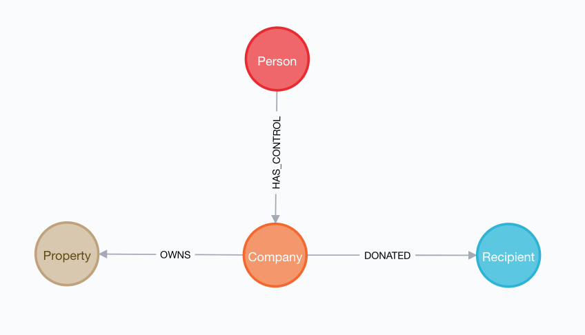

## UK Companies

Run this command in Neo4j Browser to load a Neo4j Browser guide to explore this dataset:

```
:play ukcompanies
```

Accompanying presentation slides:

* [Intro To Graph Databases For Data Journalism I
](http://bit.ly/nicargraph1)
* [Intro To Graph Databases For Data Journalism II
](http://bit.ly/nicargraph2)

Contains data from UK person of significant control corporate registy (filtered for Americans and the companies they control), UK property ownership and UK political donation datasets.


