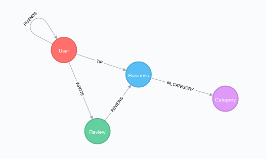

## Working with the Yelp Data Challenge in Neo4j

## Data Download
Data can be downloaded from Yelp [here](https://www.yelp.com/dataset/download), as a series of JSON files.

### Interesting queries

#### Find average rating of all "Uber" businesses

~~~
// Find average rating for all Ubers
MATCH (b:Business {name: “Uber”})<-[:REVIEWS]-(r:Review)
RETURN avg(r.stars)
~~~

#### Find potentially influential users

~~~
// Influential users
MATCH (u:User)
WITH u, size((u)-[:FRIENDS]->()) as degree
RETURN u.name, degree ORDER BY degree DESC LIMIT 10
~~~

#### What are the beers joints close to JW Marriott in Phoenix with more than 3 star average reviews

~~~
// What are the beer joints close to jw marriott with more than 3 star average reviews
WITH {latitude: 33.6834344, longitude: -111.9661334} AS jw
MATCH (b:Business)-[:IN_CATEGORY]-(c:Category) WHERE c.name CONTAINS “Beer” AND b.stars > 3
WITH b, distance(POINT(jw), POINT(b)) AS dist
RETURN b.name, dist ORDER BY dist ASC LIMIT 100
~~~

#### Simple recommendation query for Igor

~~~
// simple recommendation query
MATCH (u:User) WHERE u.user_id = “-ONOZkDHelIi0RGZm-yNkg”
MATCH (u)-[:WROTE]->(r:Review)-[:REVIEWS]->(b:Business)<-[:REVIEWS]-(r2:Review)-[:WROTE]-(u2:User)
MATCH (u2)-[:WROTE]-(:Review)-[:REVIEWS]->(rec:Business) WHERE NOT exists((u)-[:WROTE]->(:Review)-[:REVIEWED]->(rec))
RETURN rec.name, COUNT(*) AS score ORDER BY score DESC LIMIT 10
~~~

